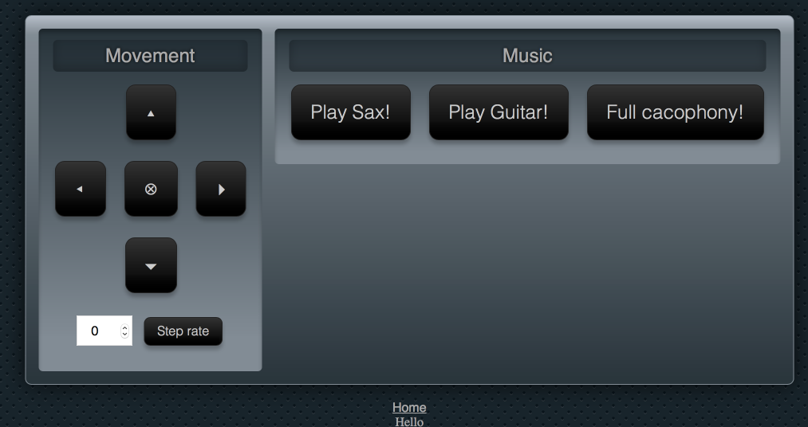

# The Saxophone (& Guitar) Playing Lunchbox on Wheels Project, controlled by Slack


The code for the project used for my Elixir Conf Europe 2016 talk [How to Build a Slack-Controlled, Saxophone-Playing Robot (on Wheels) Using Elixir and Nerves](http://www.elixirconf.eu/elixirconf2016/paul-wilson). The project consists of a plastic kitchen container with 2 [M&Ms Rockstar's](http://www.amazon.com/dp/B0188HWRIE) attached to the lid and to GPIO pins 22 and 27 of a Raspberry PI 2.  Movement is supplied by 2 [28BYJ-48 stepper motors with ULN2003 controllers](https://www.amazon.co.uk/4-Phase-5-Wire-Electric-28BYJ-48-ULN2003/dp/B00DGNO6PI) connected to other GPIO pins.

Various batteries and other bits and bobs are also needed. I will add Step by step instructions, including physical construction, to the [Cultivate blog](http://cultivateq.com/posts).


## Getting started

> I am assuming Raspberry PI 2 for now. There will be some extra steps for getting setup with a different model but it should all work.

### Configuring the build environment

Taken from the [Nerves-examples project](https://github.com/nerves-project/nerves-examples/tree/mix), mix branch.

On OS X:

```
brew update
brew upgrade elixir   ## v1.2.4, BUT NOT HEAD!!
brew install coreutils fwup
```

On All Platforms:

```
mix local.hex # update hex
mix archive.install https://github.com/nerves-project/archives/raw/master/nerves_bootstrap.ez
```


### Setting up your environment

```
cp config/rpi2/config.secret.exs.example config/rpi2/config.secret.exs
cp rel/vm.args.example rel/vm.args
```

1. Add your own [Slackbot token](https://get.slack.help/hc/en-us/articles/215770388-Creating-and-Regenerating-API-Tokens) to `config.secret.exs`
1. You can also modify the static IP you would prefer for your robot in `config.secret.exs`.  (I suggest using a static IP for now as it is easier to remote shell and find.)
1. Add your chosen IP to the `-name` in `vm.args`. This will make it easy to attach a remote console or observer to your robot.

### Test and Dev

```
mix deps.get
mix test
```

Tests should run and be green. If they are not, let me know as it means I've been very bad.

Running `iex -S mix` should enable you to browse to the web interface at [http://localhost:4000](http://localhost:4000). It should also attach to your Slack.

### Getting on to the Raspberry PI

Add an SD card to your SD card writer.

```
MiX_ENV=prod mix compile
MiX_ENV=prod mix firmware
MIX_ENV=prod mix firmware.burn
```

This should prompt you for a password and burn the image to the SD card. (I hope there was nothing you wanted to save on there.)

### Control and monitoring

You should be able to browse to the IP address that you have set up (port 80).



If the Slackbot token is set up properly you should also be able to control through the Slackbot interface. You can invite the Slackbot to a room or DM. The following commands are available:

* slackbot play sax
* slackbot play guitar
* slackbot forward
* slackbot back
* slackbot left
* slackbot right
* slackbot stop
